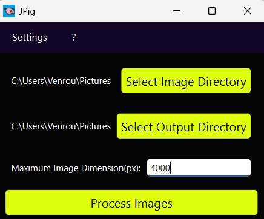

# JPyg
 JPyg was created to batch convert images to JPG at a variable size in regular intervals. A common usecase would be preparing Images to be displayed for a Website where better Color Accuracy than delivered by webp is required and where images may need to be frequently changed and resized. 

### Functionality:
- Select the Image Folder and where to save the converted images to.
- Set a size. This will be the size above which an image will be downsized proportionally so that the larger dimension equals the size variable.
- Press Process Images to start the process. The converted images will be in the output Path. This will not delete the original images, even if input and output path are the same since the file naming will be different. 




### How To Run:
```bash
git clone https://github.com/swacker-cs/JPyg.git
cd JPyg
pip install -r requirements.txt
python main.py
```

### Build executable App:
```bash
python -m PyInstaller --noconsole --onedir --icon=app_icon.ico --add-data "app_icon.ico;." --name JPyg main.py
```